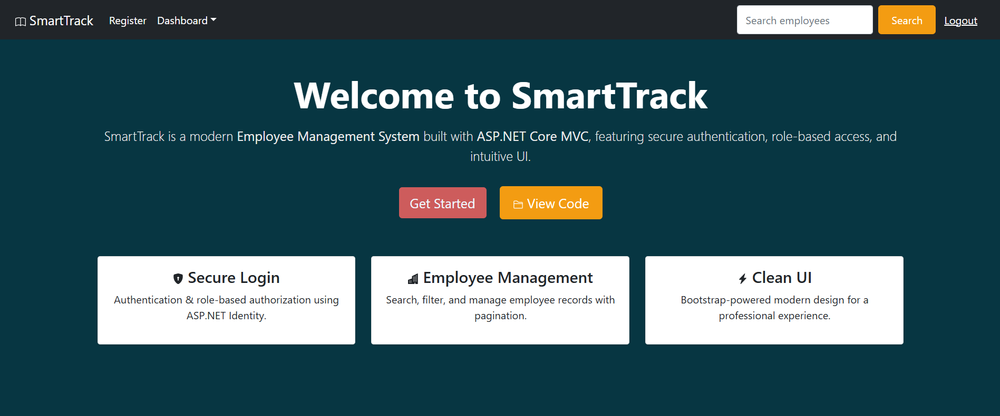
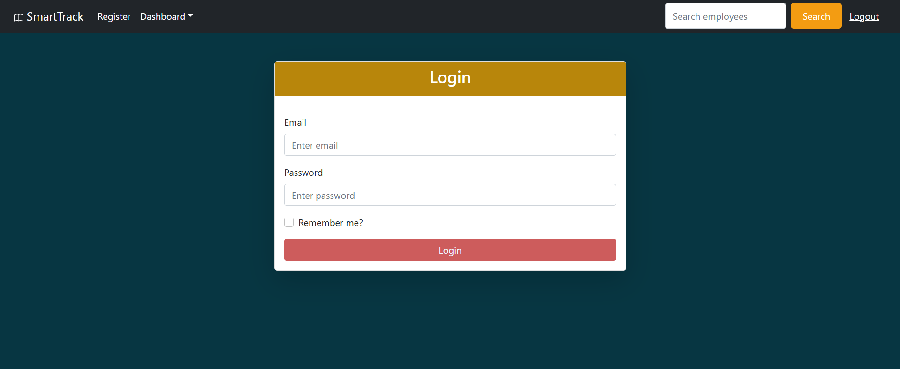
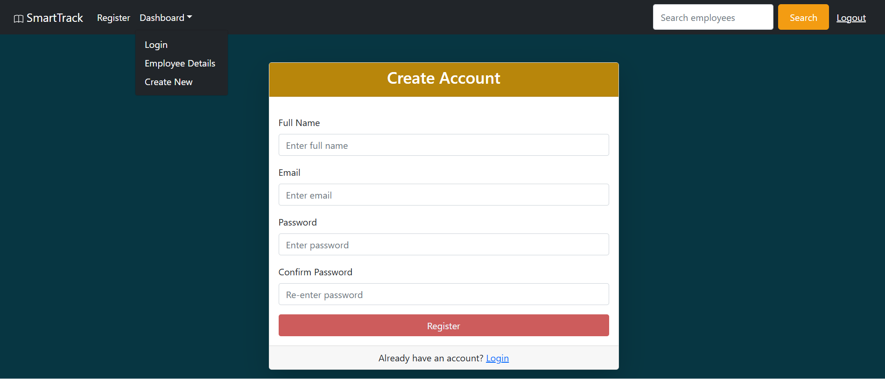
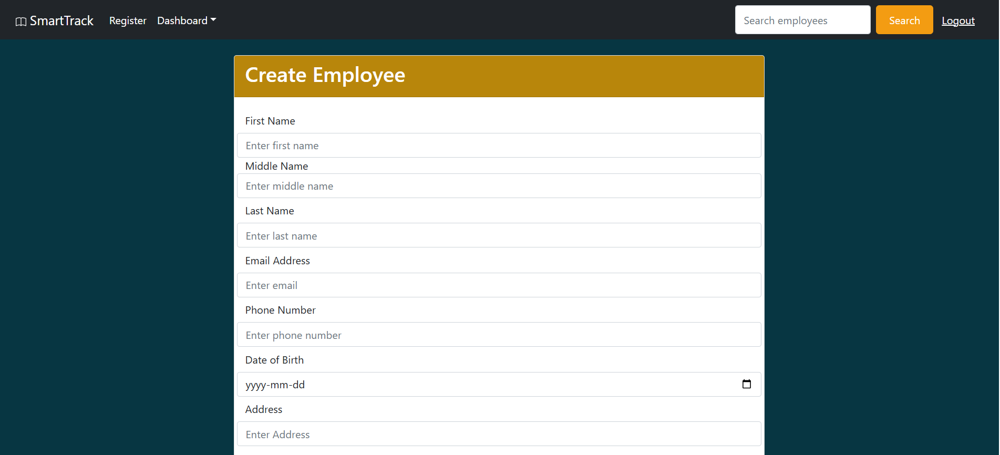
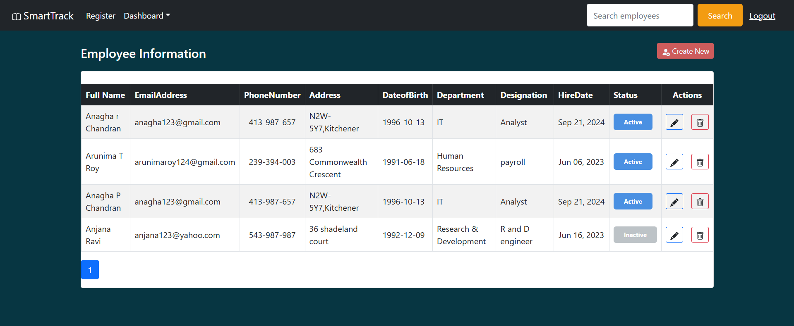
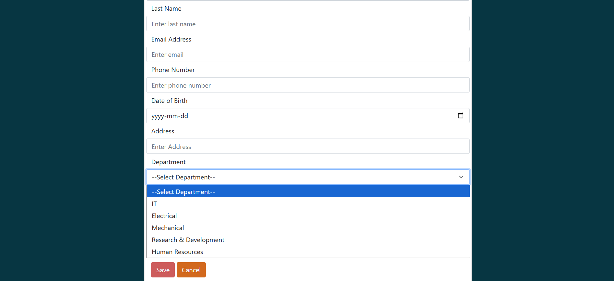

# SmartTrack

SmartTrack is a web-based Employee Management System built with **ASP.NET Core MVC**.  
It helps organizations track employees, manage roles, and simplify HR operations.

---

##  Features
-  Employee CRUD (Create, Read, Update, Delete)
-  Search & Pagination for employee lists
-  Authentication & Role-based Authorization
-  Dashboard for quick insights
-  Secure Login/Logout functionality

---

##  Technologies Used
- ASP.NET Core MVC
- Entity Framework Core
- SQL Server
- C#
- Bootstrap / CSS

---

##  Screenshots

###  Home Page

###  Login Page

###  Register Page

###  Create Employee

###  Employee Details

### Create Selection

